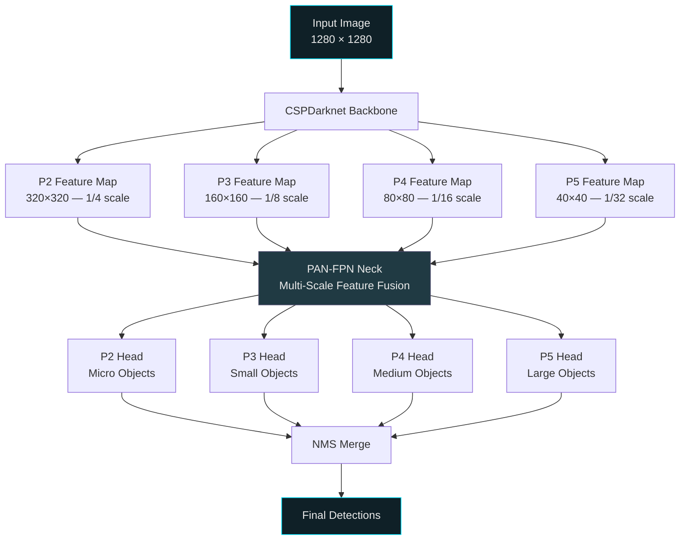
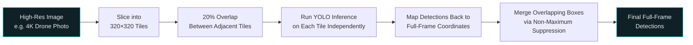
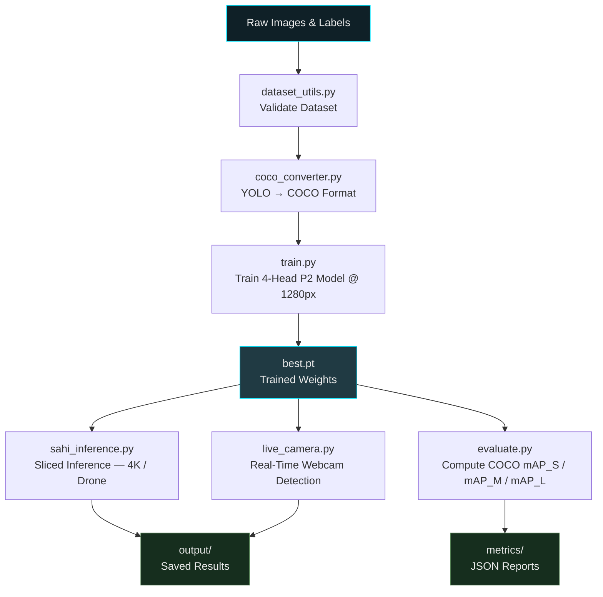

<div align="center">


<br/>


<br/><br/>


<br/><br/>


</div>

<br/>

---

<div align="center">

## 📋 Table of Contents

<table>
<tr>
<td valign="top" width="25%">

**📖 Overview**
- [Sample Outputs](#️-sample-detection-outputs)
- [Mission](#-1-project-overview--mission)
- [The Problem](#the-problem-standard-detectors-are-blind-to-small-objects)
- [The Solution](#the-solution-three-technologies-working-together)

</td>
<td valign="top" width="25%">

**🧠 Core Tech**
- [P2 Detection Head](#1--p2-high-resolution-feature-map-4-head-architecture)
- [SAHI Slicing](#2--sahi-slicing-aided-hyper-inference)
- [YOLO-World](#3--open-vocabulary-real-time-detection-yolo-world)
- [mAP_S Evaluation](#4--coco-maps-standard-metrics-evaluation)

</td>
<td valign="top" width="25%">

**🏗️ Reference**
- [Repository Structure](#️-repository-folder--file-structure)
- [File Reference](#-file-reference)
- [System Workflow](#-end-to-end-system-workflow)
- [Config Reference](#️-configuration-reference)

</td>
<td valign="top" width="25%">

**🚀 Usage**
- [Installation](#-installation--execution-guide)
- [Live Camera Controls](#-camera-keyboard-controls)
- [Training Pipeline](#option-b--train-your-custom-small-object-model)
- [Contributing](#-contributing)

</td>
</tr>
</table>

</div>

---

<br/>

## 🖼️ Sample Detection Outputs

A look at the pipeline running on three very different scenes — dense street traffic, a cluttered indoor table, and a mixed pedestrian/vehicle crossing:

<div align="center">
<table>
<tr>
<td align="center" width="33%">

<br/><sub><strong>Urban Street Scene</strong> — cyclists, pedestrians, and a truck detected simultaneously, including a partially-occluded child riding in a cargo bike</sub>
</td>
<td align="center" width="33%">

<br/><sub><strong>Cluttered Indoor Scene</strong> — a dozen+ small, overlapping objects on one table correctly separated: laptop, bottles, glassware, mouse, handbag, and more</sub>
</td>
<td align="center" width="33%">

<br/><sub><strong>Traffic & Pedestrian Scenario</strong> — road vehicles, cyclists, pedestrians, and traffic signals classified together in one frame</sub>
</td>
</tr>
</table>
</div>

> 📁 **How to get these showing up on GitHub without committing image files:** open `README.md` on github.com, click **Edit** (✏️), then drag each image straight into the text editor (or paste it from your clipboard). GitHub uploads it to its own asset CDN and inserts a URL like `https://github.com/user-attachments/assets/...`. Copy that URL and swap it into the matching `src="..."` below, replacing the `output/samples/...` placeholder path — then just commit the text change. No image files need to be added to the repo itself.

<div align="right"><a href="#small-object-detection">↑ back to top</a></div>

<br/>

---

<br/>

## 📌 1. Project Overview & Mission

Standard computer vision models — including baseline YOLOv8 — struggle badly with **small object detection**. When an object occupies only a tiny fraction of a frame (a drone in the sky, a bolt on machinery, an ant on a table), the successive downsampling inside a standard backbone strips away the very features a detection head needs before it ever gets a chance to look at them.

This project exists to solve that specific failure mode — not with one trick, but with three complementary technologies working together, each attacking a different part of the same underlying problem.

<div align="right"><a href="#small-object-detection">↑ back to top</a></div>

### The problem: standard detectors are blind to small objects

<div align="center">

| | Standard YOLOv8 | Nexus Small-Object Pipeline |
|---|---|---|
| **Detection heads** | 3 (P3, P4, P5) | 4 (**P2**, P3, P4, P5) |
| **Finest feature resolution** | 1/8 scale | **1/4 scale** |
| **High-resolution / 4K images** | Resized down, detail lost | **Sliced via SAHI**, detail preserved |
| **Vocabulary** | Fixed classes, retraining required | **Open-vocabulary**, plain-English prompts |
| **Small-object metric visibility** | Buried inside overall mAP | **Isolated via COCO mAP_S** |

</div>

### The solution: three technologies working together

1. **Custom P2 Detection Head Architecture** (`models/yolov8n-p2.yaml`) — adds a 4th, higher-resolution detection head so micro-objects survive the trip through the network instead of vanishing between layers.
2. **SAHI (Slicing Aided Hyper Inference)** — for images where even a P2 head isn't enough (4K drone footage, satellite imagery), the image itself is sliced into overlapping tiles before inference, then the results are stitched back together.
3. **Open-Vocabulary Real-Time Detection (YOLO-World + Pose)** — a live webcam pipeline that recognizes **200+ classes** described in plain English, with no retraining required, for everything from body parts to insects.

Together these three form a pipeline that's equally useful for **offline batch analysis** of high-resolution imagery and for **live, real-time** general-purpose detection.

<div align="right"><a href="#small-object-detection">↑ back to top</a></div>

<br/>

---

## 🛠️ 3. Core Features & Key Innovations

### 1. 🔬 P2 High-Resolution Feature Map (4-Head Architecture)

Standard YOLO uses 3 detection heads — **P3** (1/8 downsampling), **P4** (1/16), and **P5** (1/32). Small objects under roughly 32×32 pixels are effectively gone by the time the feature map reaches P3. Our **P2 head** taps the backbone at **1/4 scale** instead (a 320×320 grid at 1280px input), preserving the fine spatial detail that tiny objects — birds, small components, distant vehicles — need to survive.



<details>
<summary><strong>Why this matters — expand for the full explanation</strong></summary>
<br/>

Every time a convolutional backbone downsamples, it trades spatial resolution for semantic richness. That's the right trade-off for large objects, which still occupy plenty of pixels even at 1/32 scale — but it's fatal for small ones, which can shrink to a fraction of a single grid cell before the network ever reaches P3. Adding a P2 head means the model gets one more chance, at four times the spatial resolution of P3, to notice something is there before it's downsampled away entirely.

</details>

<br/>

### 2. 🧩 SAHI (Slicing Aided Hyper Inference)

Even a P2 head has limits — a 4K drone photograph resized down to fit a normal input size will still crush small objects into nothing. SAHI sidesteps that by never resizing the whole image at all. Instead, it slices the full-resolution image into overlapping tiles, runs inference on each tile independently, and merges the results back into full-frame coordinates.



The 20% tile overlap exists specifically so that an object straddling a slice boundary still appears whole in at least one tile — without it, objects sitting on a cut line would be detected as two truncated fragments instead of one. The final NMS merge pass is what reconciles that overlap back down into a single clean detection per object.

<br/>

### 3. 🌍 Open-Vocabulary Real-Time Detection (YOLO-World)

The live camera pipeline doesn't use a fixed, retrained class list at all — it detects **200+ real-world objects** described in natural language, spanning body parts, clothing, everyday items, and insects, and switches between class sets on the fly.

<div align="center">

| Class Set | Example Contents | Cycle Key |
|:---:|:---|:---:|
| **Body Parts** | Face, hand, eye, arm, torso | `C` |
| **Clothing** | Shirt, jacket, shoes, hat, bag | `C` |
| **Everyday Objects** | Cup, phone, laptop, book, bottle | `C` |
| **Tiny Objects** | Insects, small components, coins | `C` |
| **All** | Every class set combined | `C` |

</div>

Because YOLO-World matches image regions against text embeddings (via a CLIP-style encoder — see `download_clip.py`) rather than a fixed classifier head, no retraining is required to add or change what it looks for.

<br/>

### 4. 📊 COCO mAP_S Standard Metrics Evaluation

Small-object performance can easily hide inside an overall mAP score — a model can look "good enough" on paper while still missing almost every small object, because large and medium objects dominate the average. This project evaluates against the standard **COCO size-stratified metrics** specifically to prevent that:

<div align="center">

| Metric | Object Area | What It Tells You |
|:---:|:---:|:---|
| **mAP_S** | < 32² px | Small-object accuracy — the metric this whole project is built around |
| **mAP_M** | 32² px – 96² px | Medium-object accuracy |
| **mAP_L** | > 96² px | Large-object accuracy |

</div>

`src/evaluate.py` reports all three side by side, so a regression in small-object performance is visible immediately instead of being averaged away.

<div align="right"><a href="#small-object-detection">↑ back to top</a></div>

<br/>

---

## 🏗️ 2. Repository Folder & File Structure

```
Object-Detection/
│
├── config/                         # Configuration files for dataset, training & SAHI
│   ├── dataset.yaml                # Main dataset paths & 5 class definitions
│   ├── dataset_toy.yaml            # Configuration for verification testing
│   ├── sahi_config.yaml            # Hyperparameters for SAHI sliced inference
│   └── training_config.yaml        # Training hyperparameters (epochs, imgsz, optimizer)
│
├── models/                         # Custom Neural Network Architectures
│   └── yolov8n-p2.yaml             # 4-Head YOLOv8 (P2+P3+P4+P5) for small objects
│
├── src/                            # Core Source Code & Pipelines
│   ├── train.py                    # Custom P2 model training pipeline
│   ├── inference.py                # Single-image standard YOLO inference
│   ├── sahi_inference.py           # SAHI sliced inference for 4K / drone images
│   ├── live_camera.py              # Real-time live camera detection engine
│   ├── evaluate.py                 # COCO mAP_S evaluation engine (Area < 32²px)
│   └── utils/                      # Helper Utilities
│       ├── dataset_utils.py        # Dataset structure & label validator
│       ├── coco_converter.py       # YOLO label (.txt) → COCO format (.json) converter
│       └── visualization.py        # Bounding box & metrics plot renderer
│
├── dataset/                        # Training, Validation, and Test Data
│   ├── train/ (images/ & labels/)  # Training split
│   ├── val/   (images/ & labels/)  # Validation split
│   └── test/  (images/ & labels/)  # Test split
│
├── detection_models/               # Directory where trained weights (.pt) are saved
├── output/                         # Saved inference images & screenshots
│   └── samples/                     # Curated example detections shown in this README
├── metrics/                        # COCO evaluation JSON reports & metrics
│
├── generate_dataset.py             # Synthetic dataset generator for 5 custom classes
├── download_clip.py                # Resumable downloader for OpenAI CLIP weights
├── verify_pipeline.py              # End-to-end smoke test script for pipeline verification
├── requirements.txt                # System Python dependencies
├── setup.py                        # Package installation script
└── README.md                       # Project documentation
```

> ✏️ **Correction from the original notes:** `src/live_camera.py` had been accidentally listed twice under the same name as `sahi_inference.py`. It's fixed above and cross-checked against the [Summary Table](#-summary-table-of-key-scripts) below — worth double-checking your actual filesystem matches this before anyone else clones the repo.

<div align="right"><a href="#small-object-detection">↑ back to top</a></div>

<br/>

---

## 📁 File Reference

<details open>
<summary><strong>config/ — Pipeline configuration</strong></summary>
<br/>

<table>
<tr><th align="left" width="26%">File</th><th align="left">Purpose</th></tr>
<tr>
<td><code>dataset.yaml</code></td>
<td>The main dataset descriptor — train/val/test paths and the 5 custom class definitions used across training and evaluation.</td>
</tr>
<tr>
<td><code>dataset_toy.yaml</code></td>
<td>A minimal, fast-loading dataset config used specifically for verifying the pipeline works end-to-end (see <code>verify_pipeline.py</code>) without needing the full dataset.</td>
</tr>
<tr>
<td><code>sahi_config.yaml</code></td>
<td>Hyperparameters controlling sliced inference — tile size, overlap ratio, and merge behavior for <code>sahi_inference.py</code>.</td>
</tr>
<tr>
<td><code>training_config.yaml</code></td>
<td>Training hyperparameters — epochs, image size, optimizer, and related settings consumed by <code>train.py</code>.</td>
</tr>
</table>

</details>

<details>
<summary><strong>models/ — Network architecture</strong></summary>
<br/>

<table>
<tr><th align="left" width="26%">File</th><th align="left">Purpose</th></tr>
<tr>
<td><code>yolov8n-p2.yaml</code></td>
<td>The custom 4-head architecture definition — standard YOLOv8n augmented with the extra P2 detection head described above.</td>
</tr>
</table>

</details>

<details>
<summary><strong>src/ — Core pipelines</strong></summary>
<br/>

<table>
<tr><th align="left" width="26%">File</th><th align="left">Purpose</th></tr>
<tr>
<td><code>train.py</code></td>
<td>The custom P2 model training pipeline — loads <code>training_config.yaml</code> and the P2 architecture, then trains on the configured dataset.</td>
</tr>
<tr>
<td><code>inference.py</code></td>
<td>Standard single-image inference — runs the trained model on one image at a time without slicing.</td>
</tr>
<tr>
<td><code>sahi_inference.py</code></td>
<td>Sliced inference for high-resolution or drone imagery, using the parameters in <code>sahi_config.yaml</code>.</td>
</tr>
<tr>
<td><code>live_camera.py</code></td>
<td>The real-time detection engine — webcam input, YOLO-World open-vocabulary detection, pose, live SAHI toggling, and zoom.</td>
</tr>
<tr>
<td><code>evaluate.py</code></td>
<td>Computes COCO-standard mAP_S / mAP_M / mAP_L against the validation or test split.</td>
</tr>
</table>

</details>

<details>
<summary><strong>src/utils/ — Shared helpers</strong></summary>
<br/>

<table>
<tr><th align="left" width="26%">File</th><th align="left">Purpose</th></tr>
<tr>
<td><code>dataset_utils.py</code></td>
<td>Validates dataset folder structure and label formatting before training begins.</td>
</tr>
<tr>
<td><code>coco_converter.py</code></td>
<td>Converts YOLO-format <code>.txt</code> labels into a COCO-format <code>.json</code> annotation file, required for COCO-standard evaluation.</td>
</tr>
<tr>
<td><code>visualization.py</code></td>
<td>Renders bounding boxes on images and plots evaluation metrics for quick visual inspection.</td>
</tr>
</table>

</details>

<details>
<summary><strong>Root scripts</strong></summary>
<br/>

<table>
<tr><th align="left" width="26%">File</th><th align="left">Purpose</th></tr>
<tr>
<td><code>generate_dataset.py</code></td>
<td>Synthetic dataset generator for the 5 custom classes — useful for quickly producing a runnable dataset without manual labeling.</td>
</tr>
<tr>
<td><code>download_clip.py</code></td>
<td>A resumable downloader for the OpenAI CLIP weights that power YOLO-World's open-vocabulary text matching.</td>
</tr>
<tr>
<td><code>verify_pipeline.py</code></td>
<td>An automated smoke test that runs the entire pipeline end-to-end on the toy dataset to confirm nothing is broken.</td>
</tr>
<tr>
<td><code>requirements.txt</code></td>
<td>All Python package dependencies required to run the project.</td>
</tr>
<tr>
<td><code>setup.py</code></td>
<td>Package installation script for installing the project as a local Python package.</td>
</tr>
</table>

</details>

<div align="right"><a href="#small-object-detection">↑ back to top</a></div>

<br/>

---

## 🔄 End-to-End System Workflow



The pipeline forks in two directions once weights exist: **offline, high-resolution analysis** through SAHI, and **live, real-time detection** through the webcam engine — both consuming the exact same trained weights, so there's no divergence between how the model performs in each mode.

<div align="right"><a href="#small-object-detection">↑ back to top</a></div>

<br/>

---

## 💻 5. Installation & Execution Guide

### Prerequisites

<div align="center">

| Requirement | Recommended | Notes |
|:---:|:---:|:---|
| **Python** | 3.9+ | Required for all scripts |
| **GPU** | CUDA-capable | Strongly recommended for training; inference and webcam mode run on CPU too, at reduced speed |
| **Webcam** | Any USB/built-in | Only needed for `live_camera.py` |

</div>

### Step 1 — Install Requirements

```powershell
pip install -r requirements.txt
```

### Step 2 — Download Model Dependencies (for YOLO-World)

```powershell
python download_clip.py
```

<div align="right"><a href="#small-object-detection">↑ back to top</a></div>

<br/>

### Step 3 — Option A: Run Real-Time Camera Detection

```powershell
# Fast, fluid real-time camera detection (200+ open-vocabulary classes)
python src/live_camera.py --world

# Enable SAHI slicing for tiny objects
python src/live_camera.py --world --sahi
```

#### 🎮 Camera Keyboard Controls

<div align="center">

| Key | Action |
|:---:|:---|
| `C` | Cycle class sets — *Body parts → Clothing → Everyday objects → Tiny objects → All* |
| `M` | Toggle SAHI mode — Sliced ↔ Full Frame |
| `Z` | Cycle zoom — **1× → 2× → 4×** |
| `+` / `-` | Adjust confidence threshold |
| `S` | Save screenshot to `output/screenshots/` |
| `Q` | Quit |

</div>

<div align="right"><a href="#small-object-detection">↑ back to top</a></div>

<br/>

### Step 4 — Option B: Train Your Custom Small-Object Model

<table>
<tr><th align="center" width="8%">#</th><th align="left" width="30%">Stage</th><th align="left">Command</th></tr>
<tr>
<td align="center">1</td>
<td>Generate or place your dataset</td>
<td>

```powershell
python generate_dataset.py --train 300 --val 80 --test 40
```

</td>
</tr>
<tr>
<td align="center">2</td>
<td>Validate dataset structure</td>
<td>

```powershell
python src/utils/dataset_utils.py --dataset-dir dataset/
```

</td>
</tr>
<tr>
<td align="center">3</td>
<td>Convert val annotations to COCO format</td>
<td>

```powershell
python src/utils/coco_converter.py --images dataset/val/images/ --labels dataset/val/labels/ --output dataset/val/annotations/instances_val.json
```

</td>
</tr>
<tr>
<td align="center">4</td>
<td>Train the model</td>
<td>

```powershell
python src/train.py --config config/training_config.yaml
```

</td>
</tr>
<tr>
<td align="center">5</td>
<td>Evaluate mAP_S</td>
<td>

```powershell
python src/evaluate.py
```

</td>
</tr>
</table>

<div align="right"><a href="#small-object-detection">↑ back to top</a></div>

<br/>

---

## ⚙️ Configuration Reference

<div align="center">

| Config File | Controls | When You'd Edit It |
|:---|:---|:---|
| `config/dataset.yaml` | Dataset paths and the 5 class definitions | Adding/renaming classes, or pointing at a new dataset location |
| `config/dataset_toy.yaml` | A tiny verification dataset | Only when adjusting what `verify_pipeline.py` checks |
| `config/sahi_config.yaml` | Tile size, overlap ratio, merge behavior | Tuning SAHI for a different image resolution or object density |
| `config/training_config.yaml` | Epochs, image size, optimizer, and other training hyperparameters | Any time you're tuning training runs |

</div>

<div align="right"><a href="#small-object-detection">↑ back to top</a></div>

<br/>

---

## 📋 Summary Table of Key Scripts

<div align="center">

| Script | Purpose |
|---|---|
| [`src/live_camera.py`](src/live_camera.py) | Real-time webcam detector with YOLO-World, SAHI, pose, and zoom |
| [`src/train.py`](src/train.py) | Training pipeline for the custom P2 4-head small-object detector |
| [`src/sahi_inference.py`](src/sahi_inference.py) | Sliced inference for high-res / drone images |
| [`src/evaluate.py`](src/evaluate.py) | Computes COCO mAP_S metrics for small objects |
| [`generate_dataset.py`](generate_dataset.py) | Generates synthetic small-object training data |
| [`verify_pipeline.py`](verify_pipeline.py) | Automated smoke test verifying the entire codebase end-to-end |

</div>

> ✏️ **Fixed from the original notes:** the script links above now use relative repository paths (`src/live_camera.py`) instead of an absolute local path (`file:///c:/Users/User/Desktop/...`). Absolute local paths only work on the machine they were copied from — anyone viewing this on GitHub would have hit a dead link.

<div align="right"><a href="#small-object-detection">↑ back to top</a></div>

<br/>

---

## 📊 Evaluation Metrics Template

`src/evaluate.py` writes a JSON report to `metrics/` after every run. A convenient way to track progress over time is to paste each run's headline numbers into a table like this one directly in your README or a `CHANGELOG.md`:

<div align="center">

| Run / Date | mAP_S | mAP_M | mAP_L | Notes |
|:---:|:---:|:---:|:---:|:---|
| _e.g. baseline_ | — | — | — | _fill in after your first `evaluate.py` run_ |

</div>

<div align="right"><a href="#small-object-detection">↑ back to top</a></div>

<br/>

---

## 🗺️ Roadmap

<table>
<tr>
<td width="33%" valign="top">

**Near-term**
- [ ] Export trained weights to ONNX / TensorRT for faster inference
- [ ] Batch SAHI inference over a full image folder
- [ ] Confusion matrix visualization in `visualization.py`

</td>
<td width="33%" valign="top">

**Mid-term**
- [ ] Web dashboard for browsing `metrics/` reports
- [ ] Auto-labeling assist using YOLO-World predictions
- [ ] Docker image for one-command setup

</td>
<td width="33%" valign="top">

**Long-term**
- [ ] Multi-camera live detection
- [ ] Edge-device (Jetson) deployment guide
- [ ] Active-learning loop for the synthetic dataset

</td>
</tr>
</table>

<div align="right"><a href="#small-object-detection">↑ back to top</a></div>

<br/>

---

## 🤝 Contributing

<div align="center">


</div>

<br/>

### Ways to help

<table>
<tr><th align="left" width="22%">Type</th><th align="left">What that looks like</th></tr>
<tr>
<td>🐛 <strong>Bug report</strong></td>
<td>Open an issue with the exact command you ran, your Python/CUDA version, and the full error traceback.</td>
</tr>
<tr>
<td>🧠 <strong>Architecture change</strong></td>
<td>If you're modifying <code>models/yolov8n-p2.yaml</code>, include a before/after mAP_S comparison from <code>evaluate.py</code> in your PR description.</td>
</tr>
<tr>
<td>🧩 <strong>New class / dataset support</strong></td>
<td>Update <code>config/dataset.yaml</code> and regenerate or re-validate via <code>dataset_utils.py</code> before opening a PR — don't hand-edit label files directly.</td>
</tr>
<tr>
<td>⚡ <strong>Performance</strong></td>
<td>SAHI tiling parameters, NMS thresholds, and inference speed improvements are always welcome — benchmark before/after and include numbers.</td>
</tr>
<tr>
<td>📝 <strong>Docs</strong></td>
<td>Clarifications, fixed commands, or missing explanations in this README are fair game for a quick PR.</td>
</tr>
</table>

### Submitting a pull request

1. **Fork** the repo and branch off `main` with a name describing the change (`feat/onnx-export`, `fix/sahi-overlap-bug`).
2. **Run `verify_pipeline.py`** before opening the PR — it's the fastest way to confirm your change hasn't broken the end-to-end pipeline.
3. **Keep configs and code in sync** — if a change needs a new hyperparameter, add it to the relevant `config/*.yaml` rather than hardcoding it in the script.
4. **Include evaluation numbers** for any change touching the model architecture, training loop, or inference logic.
5. **Open the PR** with a clear description of the *what* and *why*, and which script(s) you tested.

<div align="right"><a href="#small-object-detection">↑ back to top</a></div>

<br/>

---

## 🙏 Acknowledgments

This project builds directly on the shoulders of several open-source projects and research efforts:

<div align="center">

| Project | Used For |
|:---|:---|
| **[Ultralytics YOLOv8](https://github.com/ultralytics/ultralytics)** | Base detection architecture, extended with the custom P2 head |
| **[SAHI](https://github.com/obss/sahi)** | Slicing Aided Hyper Inference for high-resolution / drone imagery |
| **[OpenAI CLIP](https://github.com/openai/CLIP)** | Text-image embedding backbone powering open-vocabulary detection |
| **[COCO Dataset & Metrics](https://cocodataset.org/)** | Standard mAP_S / mAP_M / mAP_L evaluation protocol |

</div>

<div align="right"><a href="#small-object-detection">↑ back to top</a></div>

<br/>

---

<div align="center">

<sub>Built for the objects standard detectors overlook.</sub>

</div>


